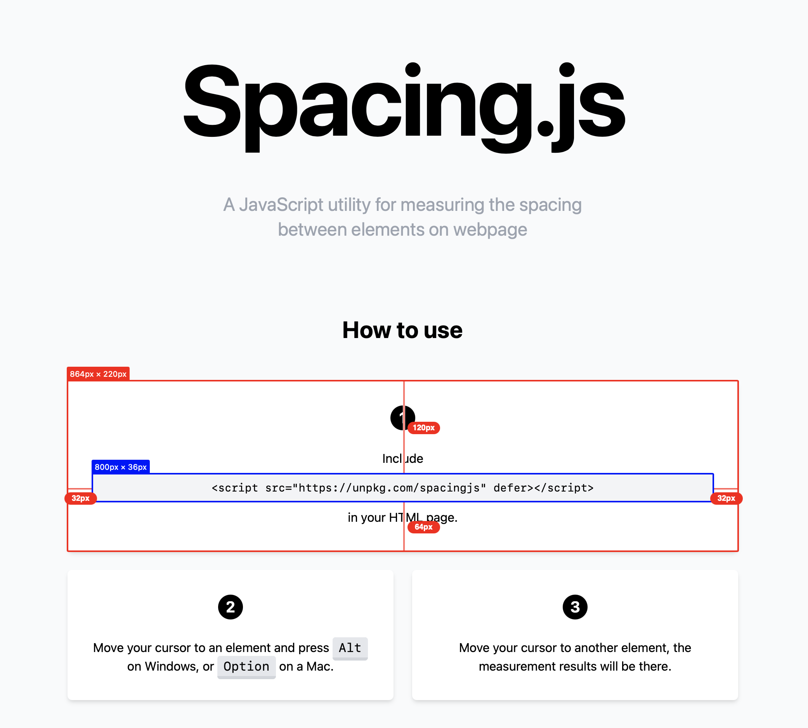

# Spacing JS

[](https://www.npmjs.com/package/@stevenlei/spacingjs)


A JavaScript utility for measuring the spacing between elements on webpage. This is supposed to be used during development only. [Try this out](https://spacingjs.com).



Read this document in other languages: [English](README.md), [繁體中文](README.zh-Hant.md), [简体中文](README.zh-Hans.md).

## How to use

1. Include Spacing.js with `<script>` tag in your HTML page:

```html
<script src="//unpkg.com/spacingjs" defer></script>
```

1. Move your mouse cursor to an element, and press <kbd>Alt</kbd> on Windows or <kbd>⌥ Option</kbd> on a Mac.

2. Move your mouse cursor to another element, the measurement results will be there.

## Contribute

Feel free to fork this repository and submit pull requests. Bugs report in [GitHub Issues](https://github.com/stevenlei/spacingjs/issues), features/ideas/questions discuss in [GitHub Discussions](https://github.com/stevenlei/spacingjs/discussions).

## License

Spacing.js is [MIT Licensed](LICENSE).